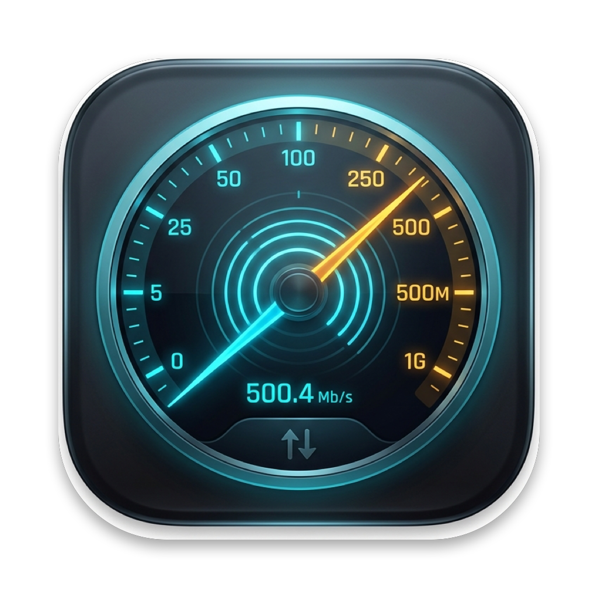

<p align="center">
  
</p>

<h1 align="center">ThrottleNet</h1>

<p align="center">
  <strong>A lightweight, native macOS menu bar and dashboard app to monitor per-process network bandwidth in real-time and throttle upload & download speeds for individual processes.</strong>
</p>

<p align="center">
  <a href="https://apple.com/macos"></a>
  <a href="https://swift.org"></a>
  
  <a href="LICENSE"></a>
  <a href="Casks/throttlenet.rb"></a>
  <a href="CONTRIBUTING.md"></a>
</p>

---

## ⚡ Key Features

- **Real-Time Bandwidth Monitoring**: Continuously measures download and upload bandwidth per process (KB/s, MB/s) with delta rate calculations and mini live sparklines.
- **Independent Speed Throttling**: Configure independent **Download** and **Upload** limits for any macOS process (e.g. `cloudd`, iCloud Drive sync, Dropbox, OneDrive, browsers, backup daemons, torrent clients).
- **Persistent Auto-Rules**: Save rules for frequently throttled apps. ThrottleNet automatically detects when target processes launch and applies your preset rate limits immediately.
- **Interactive Limit Controls**:
  - Fine-grained speed sliders.
  - Direct numeric speed input (in KB/s or MB/s).
  - Quick-preset chips (`100 KB/s`, `250 KB/s`, `500 KB/s`, `1 MB/s`, `2 MB/s`, `5 MB/s`, `10 MB/s`).
- **Dynamic Socket Tracking**: Dynamically tracks open TCP/UDP socket ports for target PIDs so new network connections created by the application are automatically rate-limited.
- **Single-Prompt Background Helper**: Employs an intelligent privileged helper so you only authenticate once—no repetitive administrator prompts when adjusting rules.
- **Native SwiftUI Menu Bar & Dashboard**: Sleek macOS interface with global aggregate metrics, search bar, process filters (`All`, `Active Traffic`, `Throttled`, `User Apps`), and multi-field sorting.
- **Clean & Safe Teardown**: Automatically releases all `pf` anchors and `dnctl` pipes on exit, or on-demand using the "Reset All" button.

---

## 📦 Installation

### Option 1: Install via Homebrew (Recommended)

You can install ThrottleNet with a single command via [Homebrew](https://brew.sh):

```bash
brew install --cask moeezali2375/tap/throttlenet
```

Or tap the repository first:
```bash
brew tap moeezali2375/tap
brew install --cask throttlenet
```

To update in the future:
```bash
brew upgrade --cask throttlenet
```

### Option 2: Download Standalone Release
1. Download `ThrottleNet-v1.0.0-macOS.zip` from the [Releases](https://github.com/moeezali2375/throttlenet/releases) page.
2. Unzip the archive and move `ThrottleNet.app` to your `/Applications` directory.
3. Open ThrottleNet.

### Option 3: Build from Source
```bash
git clone https://github.com/moeezali2375/throttlenet.git
cd throttlenet

# Run directly in development mode
swift run ThrottleNet
# or
./Scripts/run.sh
```

To build a standalone `.app` bundle:
```bash
./Scripts/build_app.sh
```
The compiled application will be placed in `build/ThrottleNet.app`.

---

## 🛠 How It Works Under The Hood

```
┌────────────────────────────────────────────────────────┐
│               SwiftUI Application (UI)                 │
│  - Menu Bar Extra / Window Dashboard                   │
│  - Real-time Process Bandwidth List (Up/Down KB/s)     │
│  - Per-process Throttle Slider & Numeric Speed Limits  │
│  - Persistent Saved Rules Manager                      │
└──────────────────────────┬─────────────────────────────┘
                           │ App State / Combine
┌──────────────────────────▼─────────────────────────────┐
│                 Core Network Engine                    │
│  ┌──────────────────────────┐┌───────────────────────┐ │
│  │ Process Network Monitor  ││   Socket Inspector    │ │
│  │ (nettop -n / libproc)    ││ (lsof / proc_pidinfo) │ │
│  └──────────────────────────┘└───────────────────────┘ │
└──────────────────────────┬─────────────────────────────┘
                           │ Privileged Helper FIFO
┌──────────────────────────▼─────────────────────────────┐
│             macOS Traffic Shaping Layer                │
│  - dnctl (Dummynet): Configures bandwidth pipes (KB/s) │
│  - pfctl (Packet Filter): Injects isolated rules into  │
│    the throttlenet/<pid> anchor                        │
└────────────────────────────────────────────────────────┘
```

1. **High-Efficiency Bandwidth Polling**:
   `NetworkMonitor` samples the macOS network diagnostic subsystem (`nettop -n`) with reverse DNS disabled, achieving sub-15ms delta sampling with near-zero CPU impact.

2. **Dummynet Traffic Shaping (`dnctl`)**:
   When a process is throttled, `TrafficShaper` creates dedicated Dummynet pipes (e.g. `dnctl pipe 1000 config bw 500Kbyte/s`).

3. **Packet Filter Anchors (`pfctl`)**:
   `SocketTracker` inspects the target PID's open local socket ports using `lsof` and `proc_pidinfo`. Rules are injected into dedicated `throttlenet/<pid>` anchors, ensuring non-throttled system traffic remains untouched.

4. **Persistent Rule Sync**:
   `PersistentRuleStore` saves configured rules to disk and watches for target application launch events, automatically applying configured limits whenever the matching process appears.

---

## 📁 Project Structure

```
throttlenet/
├── Package.swift                             # Swift Package Manager manifest
├── Casks/                                    # Homebrew Cask formula
│   └── throttlenet.rb
├── Resources/                                # App Icons & Graphic Assets
│   ├── AppIcon.icns                          # Native macOS multi-resolution icon bundle
│   ├── AppIcon.png                           # Master 1024x1024 app icon
│   ├── AppIconMinimal.icns                   # Alternative minimal neon icon bundle
│   └── AppIconMinimal.png                    # Alternative minimal master icon
├── Sources/
│   ├── ThrottleNetCore/                      # Core Logic & UI Library
│   │   ├── Models/                           # Data models & state
│   │   ├── Services/                         # Network monitor, shaper & socket tracker
│   │   ├── ViewModels/                       # Combine dashboard viewmodel
│   │   └── Views/                            # SwiftUI views & components
│   ├── ThrottleNetApp/                       # App entry point & lifecycle
│   └── ThrottleNetTestsRunner/               # Automated test runner suite
└── Scripts/
    ├── build_app.sh                          # Compiles & packages standalone ThrottleNet.app
    ├── package_release.sh                    # Packages release zip, computes SHA256 & updates cask
    └── run.sh                                # Quick launch development script
```

---

## 🧪 Testing

To run the automated test suite verifying unit models, speed conversions, socket parsing, rule persistence, and live sampling:

```bash
swift run ThrottleNetTestsRunner
```

---

## 🔒 Privileges & Permissions

Bandwidth throttling uses macOS's built-in `dnctl` (Dummynet) and `pfctl` (Packet Filter) subsystems, which require administrator privileges.
- When applying a throttle rule for the first time, macOS will prompt once for administrator authorization to initialize the background helper.
- ThrottleNet isolates all injected rules into its own PF anchor namespace (`throttlenet/*`). It **never** alters existing system firewall rules or general network routing tables.
- All rules and pipes are flushed cleanly upon application quit or via the **Reset All** button.

---

## 🤝 Contributing

Contributions, bug reports, and feature requests are welcome!
- Check out [CONTRIBUTING.md](CONTRIBUTING.md) for development instructions.
- Please review our [Code of Conduct](CODE_OF_CONDUCT.md).
- For security disclosures, refer to [SECURITY.md](SECURITY.md).

---

## 📄 License

ThrottleNet is open source software licensed under the [MIT License](LICENSE).
